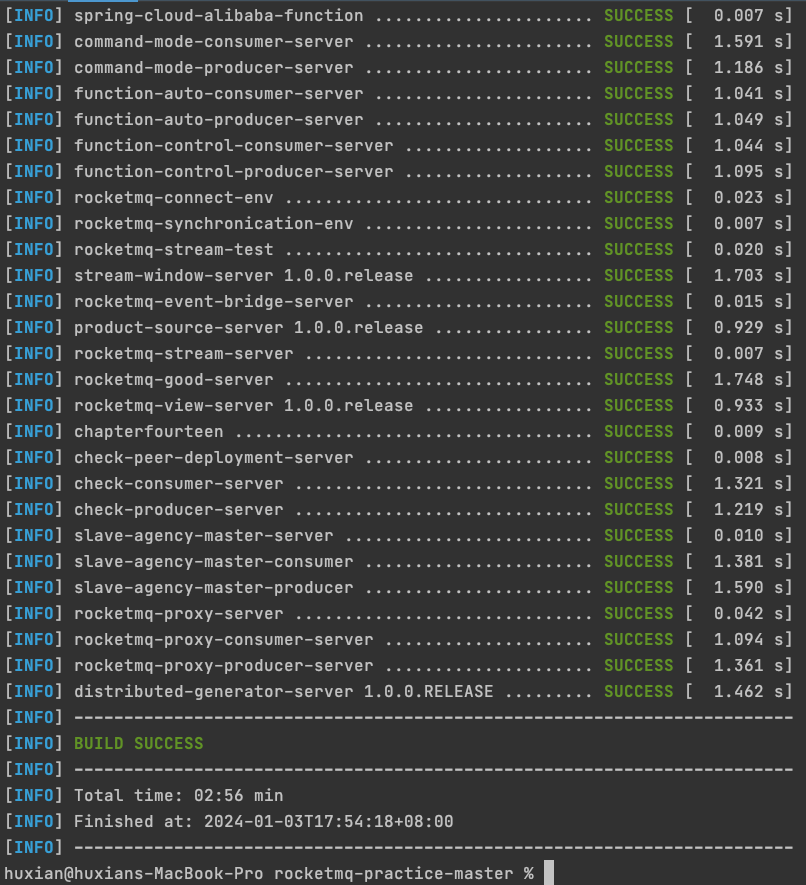

## RocketMQ消息中间件实战派上下册源码说明

------

### 1. 下载tag分支代码，本源码支持JDK版本为1.8
(1)查看JDK版本


(2)查看Maven版本


### 2. 切换到根目录rocketmq-practice 使用Maven打包命令，重新编译源码

源码已经去掉了target目录下的jar包，方便大家下载

(1) 在根目录中输入如下命令直接打包
```java
mvn clean install -Dmaven.test.skip=true
```
如果出现如下结果，就代表打包成功啦


(2) 也可以使用IDEA去Root工程下面直接打包


如果出现如下结果，说明已经编译和打包成功

### 3. 执行SQL语句（数据库类型为MySQL，技术小伙伴需要提前下载并安装好MySQL）
    直接执行rocketmq-practice/rocketmq-practice.sql和rocketmq-practice/rocketmq-application.sql语句
(1) 本源码对应的MySQL的版本为8.0.2.1


(2) 执行完成sql语句之后的结果如下。


### 4. 说明

本书是偏实战性的书籍，需要大家自己动起来，这样才能体现本书的价值，希望大家能够学习愉快。

可以关注本人维护的技术干货公众号和视频号"架构随笔录""，后续会有很多推文，谢谢
扫描以下二维码关注公众号"架构随笔录"


扫描以下二维码关注视频号"架构随笔录"
